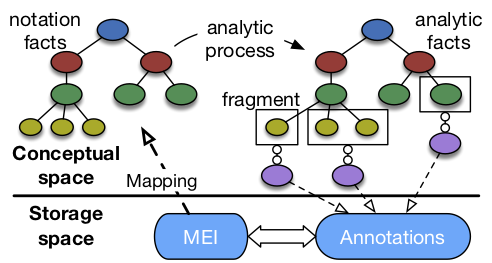
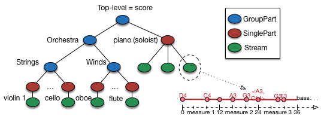

# The case for the modeling of a music (content) infoset
Working draft - Philippe Rigaux (Cnam)

In this document:
 
  - General ideas for modeling explicit and implicit data strutures fund in music notation, and expected benefits
  - Examples: transcription, styling, analysis, annotations... 
  - Technical aspects (preliminary)
 
##  What do we find in music score encodings

Current score encodings are based on traditional sheet scores, whose aim is to convey the notation
to performers (or analysts) clearly, efficiently and consistently. Yet, many digital applications that
use these scores as input for other purposes are *not* concerned with details that pertain to (human) readability. Page
sizes, fonts, margins are useless for digital performers or digital analysts. The same can, IMO, be said
for some other aspects, although they seem more tightly related to music notation: allocation of notes to staves, clef,
positioning.

Therefore, my point is the following: *by trying to capture all elements that contribute to the final
score layout, digital encodings of scores mix several concerns of completely distinct nature*. It would
really pay off to *separate these concerns*, with potential benefits for applications that to *not* aim at merely displaying
music notation. More easily said than done, but the challenge is both quite interesting, and may lead to extremely useful achievement.

> Let's call s 'digital music app' of DMAP (find better) from now on the applications which are not oriented toward score rendering. 
> Typical examples: a (digital) performer (e.g., MIDI performer, 
> or hopefully a more sophisticated one) ; a (digital) analyser (i.e., a tools that extract some high-level features from a score);
> music transcription; Optical Music Recognition (OMR). Some further thoughts on these applications are given later.

In the following, I list some of these benefits. Basically, we work on the assumption that there is a subset of the data 
found in score encodings (I will mostly consider MEI)  that 
contains the sufficient and necessary content for most (or all) DMAP. I will call this subset **music content infoset** 
(inspired by XML normalization efforts, see below - and waiting for a better term), or MCI  for short.

### Benefit 1 : improve entropy

Music score files are often huge, and their structure is extremely complicated (probably because of 
this aggregation of concerns mentioned above). When such files
are used as input for a DMAP, the amount of noise is great, whereas the amount of useful content is quite limited
with respect to the file size. If we could identify and extract the MCI and use it as input, the
entropy would be greatly improved, with obvious advantages: 

  - less noise, and probably better quality of the useful content
  - clarification on the information really required by DMAPs 
  - opportunity for better structures, higher abstraction levels, possibly algebraic or logic-based manipulations, etc.

### Benefit 2 : less dependence on syntactic idiosyncrasies

There exist many ways to encode a same score. This does complicate parsing and interpretation of score content. 
Here, the MCI would act as an abstract level where encoding practices would disappear in favor of a more *canonical* representation. Several immediate practical impacts

  - ability to *compare* scores much more easily
  - versioning and evolution management

> This issue appeared in the early days of XML when it became a "language" of choice for data storage 
> and exchange. The W3C felt the need, *after* the recommendation of XML syntax, to define the so-called 
> [XML information set][1] that defines the content of an XML file independently from syntactic variants 
> (e.g., entity dereferencing, blan nodes, etc.). The DOM
> or the XPath data models are somehow two implementations of the XML infoset, although slightly different.

I do think that we would feel much more comfortable with a well-structured data model, and we could much more easily leverage
this model to achieve a true semantic layer to interact with music notation.

### Benefit 3: separation of concerns leads to independent styling

The relevant comparison here is with HTML documents and web layouts. Whereas in the early days (hopefully gone for everybody), HTML contained *both* content 
(e.g., text) *and* presentation instructions, they are now neatly separatated with core HTML + CSS. In a more general setting,  
the same holds for XML + XSLT.

In the context of music: ideally we could pair some MCI content with one *or many* 'score sheets' with the potential ability to 
produce *many* layouts from 
a single content input. There are some quite practical and very useful applications: displaying separately one or several voices ; displaying variants 
or annotations along with a "main" score; transposition, harmonic reductions, etc. There are some touchy issues there (producing socres for separate voices for instance
complies to specific rules and cannot be obtained readily from the general score), but this seems a very exciting and potentially fruitful challenge.

### Benefit 4: better semantics

In principle, if we can "view" a score content as an instance of a well-defined data model, nothing can prevent from defining operations of various kinds,
at an abstract, ideally declarative level. Moreover, it becomes much easier to pair a model instance or parts of this 
instance with other resources, at a consistent, high level of abstraction independent from 
storage, serialization or encoding issues. 

Note: this is the approach that we followed at Cnam in [time series modeling][2] which proposes a query language, but can be declined 
for other situations. It gives a detailed example of the methodology.

### Summary: the case for a music notation info set, and its impact for linked data

In a project that aims at producing "semantic" data in order to link this data with other sources (annotations), I think it is worth trying to 
identify what is the meaningful content encoded is a score, and to model this content. 'Meaning' is necessarily 
related to applications, and to the set of information required by these applications. The main assumption in this context
is that there is a common info set that can serve as input to a range of applications, and that we can safely ignore 
any other content embedded in the score which can then simply be considered as "noise" from the application viewpoint.

Practically speaking, a MEI file for instance would be the source from which one extracts an instance of 
MCI, represented in whatever form is suitable (e.g., RDF, JSON-LD, Music21 classes, etc). 
A server would "publish" this instance as a support for annotations, transformations, or any other 
process (musicological analysis for instance) that requires
as input a clean and well structured representation of music notational content. 

## Examples 

### Example 1: from notation to performance and vice-versa

Firs example: we consider the problem of producing an audio performance from some notation input, and conversely notation
from audio input (called *transcription*). Illustrated by the following figure. It assumes an ideal, digital performer, 
basically a MIDI device, or something more sophisticated (e.g., equipped with a performance model, see [the MPM model][2].
In all cases, the performer is apt at decoding its input 

First: there exists a large class of score encodings for which the resulting performance will be the same. This class contains syntactic variants, but
the performance is also insensitive to important layout choices such as the number of staves and their ordering. The content common to  these scores  
constitutes our MCI. From this MCI alone, it is
possible to produce the performance. 

Said otherwise, the MCI is an invariant for this class of scores with respect to the production of a digital performance [6].  
If the  performer is a MIDI device, then the invariant is simply 
the MIDI encoding extracted from the score. We get rid of

  - all page layout instructions
  - all metadata
  - all specifications related to staves and clefs
  - all textual annotation

Basically, the only remaining part are voices (channels in MIDI terms), i.e., sequences of pitches. Now, if we want something
more realistic / pleasant, we ask the performer to take into account  additional information: metric is important from strong / weak beats,
slurs are also required. Performances instructions (dynamics) can be of interest. The precise list of features of the MCI is to 
be determined.

> The case of the *key signature* is interesting. In principle, knowing the alteration of each note is equivalent. However, the key
> signature yields an implicit information on the global tonality of the music piece. Is this information useful for performance ? Can it 
> be inferred without an explicit coding? In a knowledge-based approach, should'nt we represent it as a first-class concept rather
> than as a set of alterations?

Consider now the reverse processs: transcription. From an audio signal we aim at producing the score. Obviously, there is not enough
information in the audio file to infer the presentation elements listed above: page layout, staves, clefs, etc. However, the transcription
process should be able to produce the MCI as suggested above: voices, and articulation aspects. 

### Example 2: styling score sheets

From this MCI, the figure shows an additional step: styling. With a dedicated styling language, we could ideally enumerate all possible scores
from a same MCI. (To be developped).

### Example 3: analysis and annotations

An analytical process consumes some notation content (hypothetically, our MCI) and produces annotations. Referring to [IReMus study][5], 
this introduces the following needs: 
  - "The possibility to address arbitrary sets of MEI elements that do not necessarily follow the logical organization of the MEI 
     XML file structure".
  - "The possibility to address musical offsets for events not explicitly present in the score" (see [5] for an example)

The latter illustrates an interesting feature: the need to add to our MCI anchors (IRI) which are not explicitly present in the encoding. These anchors can be referred to in the annotations. The annotation space wold then be fully defined at the abstract level, with a materialisation of some events which not necessary in terms of strict notational content.

##  Revealing Structures from Music Notation 

Music notation formats (MusicXML, MEI) are generally seen as as mean to organize, using a semi-structured language, the whole 
data set that can be collected to describe a music score. Let's adopt another perspective: these XML files contain a serialization
of one or several, mixed, data structures, and these structures are partly lost or hidden during the serialization process. Our goal
is to reconstruct them.

Essentially, all the structures that we can identify are hierarchical.

### Structuring the score 

The first hierarchy is almost explicit in all score encodings we are aware of. 
A score is made of parts.  A group (of parts) consists of a set of subparts, and mostly serves
the organizational aspect of the score. For instance, the orchestral material	of a concerto score typically 
defines a group for wind instruments, another one for 	string instruments, etc.  A single encapsulates the music notation elements assigned
to an individual performer (instrument or vocal). The following figure shows for instance
a single part for the soloist (piano), another one for the violins, cellos, etc.
A single part contains one or several voices.
 

## References

[1]:  <https://www.w3.org/TR/2004/REC-xml-infoset-20040204>(XML information set. W3C recommendation.)

[2]: <https://hal.archives-ouvertes.fr/hal-02454536>(Fournier-S'niehotta, R.; Rigaux, P. and Travers, N. Modeling Music as Synchronized Time Series: Application to Music Score Collections. In Information Systems, 73: 35-49, 2018)

[3]: <https://hal.archives-ouvertes.fr/hal-02454536>(Cherfi, S. S-s.; Guillotel, C.; Hamdi, F. c.; Rigaux, P. and Travers, N. Ontology-Based Annotation of Music Scores. In Knowledge Capture Conference, pages 1-4, ACM Press, Austin, 2017.)

[4]: <https://axelberndt.github.io/MPM/>(Music Performance Markup format - MPM)

[5]: <https://github.com/Amleth/source-sherlockizer-service>(Some technical thoughts on processing MEI sources to facilitate their future scholarly semantic annotation)

[6]: <https://en.wikipedia.org/wiki/Invariant_(mathematics)>(Definition of invariant)
